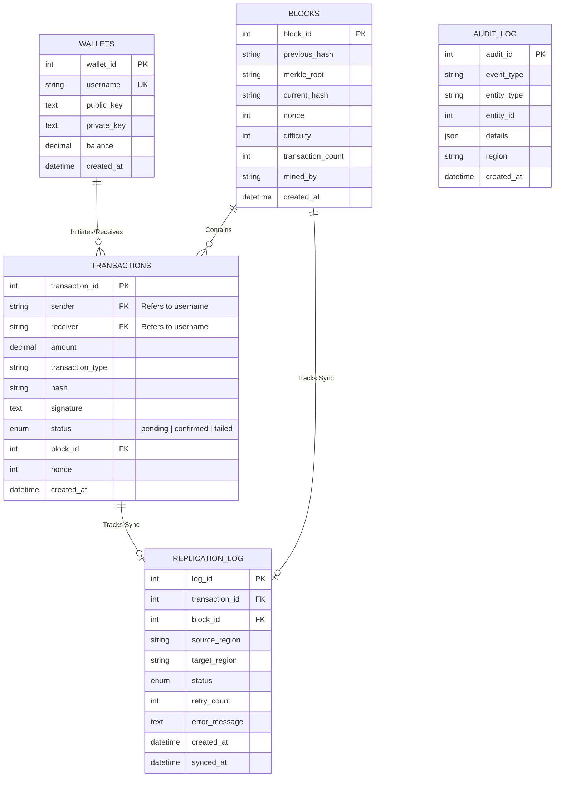

# ChainSync: Distributed Blockchain DBMS
**Presentation Content & ER Diagram Guide**

This document contains exactly the content you need for your presentation slides based on the outline you provided, along with the Mermaid ER Diagram for your database schema.

---

## Slide 1: Introduction to the Chosen Problem (1/2) 
**Title: The Vulnerability of Centralized Data**
* **Single Points of Failure:** Traditional database systems, even when backed up, often rely on centralized control. If a primary datacenter goes offline due to a localized disaster or network failure, the entire application halts.
* **Tamper Susceptibility:** In a standard RDBMS, database administrators with root access can silently alter financial or critical records directly in the tables without triggering application-level logs, compromising data integrity completely.

## Slide 2: Introduction to the Chosen Problem (2/2) 
**Title: The Distributed Consensus Challenge**
* **Global Synchronization:** Achieving real-time data consistency across geographically distant datacenters (e.g., India, US, Europe) is notoriously difficult due to network latency and packet loss.
* **Byzantine Faults & Split-Brain:** In distributed computing, a node might experience silent data corruption (a 'Byzantine fault'). Detecting which datacenter holds the "truth" without heavily impacting system performance remains a core data engineering challenge.

## Slide 3: Background and Motivation (1/2)
**Title: Bridging Web2 Speed with Web3 Security**
* **The Performance Gap:** Native blockchains (like Bitcoin or Ethereum) are highly secure and immutable, but they are far too slow and expensive to query for standard enterprise web applications. 
* **The Zero-Trust Era:** Modern financial tech and enterprise systems demand "Zero-Trust Architectures" where data integrity is mathematically verifiable rather than just blindly trusted. 

## Slide 4: Background and Motivation (2/2)
**Title: Motivation for ChainSync**
* **The Hybrid Vision:** Our motivation was to build a system that combines the high-speed, flexible querying of a standard SQL database with the cryptographic immutability of a blockchain.
* **Global Redundancy:** We wanted to build a true multi-region project showing exactly how data behaves when instantly distributed across multiple continents, bringing theoretical distributed DBMS concepts to life visually.

## Slide 5: Problem Statement and Objectives
**Title: Problem Statement & Project Objectives**
* **Problem Statement:** Traditional RDBMS systems lack inherent cryptographic immutability against internal tampering, while native blockchains lack the querying speed and relational structure required for modern applications.
* **Key Objectives:**
  1. Build a 3-node distributed database architecture (India, US, EU).
  2. Implement a blockchain-inspired application layer using RSA signatures, Merkle Roots, and Proof-of-Work (PoW).
  3. Ensure instantaneous, fault-tolerant continuous data replication.
  4. Develop a real-time topology dashboard to visualize cryptographic integrity across the globe.

## Slide 6: General Solution (1/2)
**Title: The Distributed Infrastructure Architecture**
* **Global Node Deployment:** We deployed three independent MySQL 8.0 instances inside Docker, simulating physical datacenters in AP-South-1 (India, Primary), US-East-1 (America, Replica), and EU-Central-1 (Europe, Replica).
* **The Sync Engine:** A Node.js backend cluster acts as the middleman. It intercepts local transactions from the primary region, executes the cryptographic heavy-lifting, and then orchestrates parallel replication streams to the secondary datacenters.

## Slide 7: General Solution (2/2)
**Title: The Cryptographic Ledger Implementation**
* **Transaction Verification:** Whenever a user sends assets, it generates an RSA digital signature. 
* **Block Minting (PoW):** Transactions are grouped into immutable blocks connected via a `previous_hash` chain. The system calculates a Merkle Root for the transactions and solves a Proof-of-Work hashing algorithm (finding a hash starting with a specific number of zeros).
* **Constant Integrity Polling:** The system continuously generates full-chain SHA-256 fingerprints across all three global databases to ensure no node has silently altered a record.

## Slide 8: DBMS-related Solution: Why?
**Title: Why a Ledger Database over purely NoSQL/Blockchain?**
* **ACID Compliance:** By using MySQL as the base storage layer, we retain guaranteed ACID (Atomicity, Consistency, Isolation, Durability) properties over the data writes.
* **Complex Data Retrieval:** A relational schema allows us to build powerful tools like our "Distributed Database Explorer", enabling us to join users, transactions, and blocks effortlessly—something deeply complex in standard raw blockchains.
* **Best of Both Worlds:** We let MySQL do what it does best (store structured data and execute fast queries) and let Node.js enforce the mathematical constraints, creating an immutable "Ledger Database".

## Slide 9: Plan of Implementation
**Title: Development Timeline & Implementation Phases**
* **Phase 1: Foundation (DB & Infra):** Constructing the Docker Compose network, configuring root access, unifying genesis blocks, and initializing the MySQL schemas across 3 containers.
* **Phase 2: Core Blockchain Logic:** Developing the `cryptoService`, `hashService`, and `merkleService` to handle RSA pair generation, block mining, and transaction validation.
* **Phase 3: Cross-Region Replication:** Building the async replication engine to duplicate mined blocks to the US and EU nodes, complete with retry mechanisms and latency simulation.
* **Phase 4: Full-Stack Integration:** Creating the premium Dark-Themed UI, connecting the Express APIs, and building the Network Topology Analyzer.

## Slide 10: Expected Output
**Title: Final Deliverables & Demonstration**
* **Real-time Interface:** A highly polished, responsive dashboard simulating a live fintech or crypto environment for instant asset transfers.
* **Global Network Topology Monitor:** A live view of all three datacenters showing block heights and instant cryptographic integrity verification (identifying Hash Mismatches if data is tampered with).
* **Distributed Database Explorer:** A bespoke tool to run simultaneous SQL queries across the India, US, and EU containers, proving perfect synchronous replication live during the evaluation.

---

## Database ER Diagram

You can take a screenshot of this ER diagram or copy its logic into your presentation to explain the database schema.

